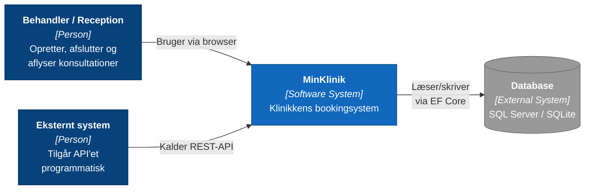
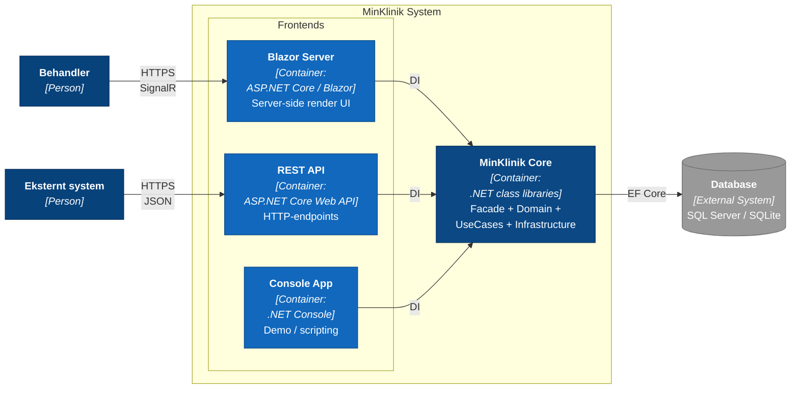
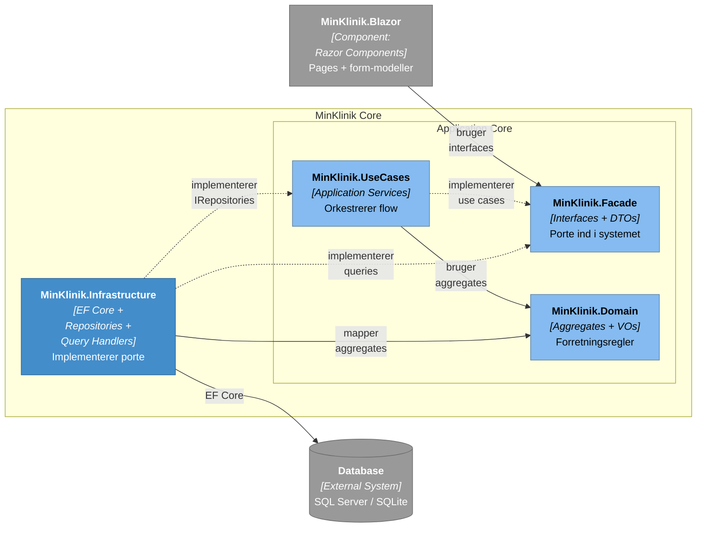
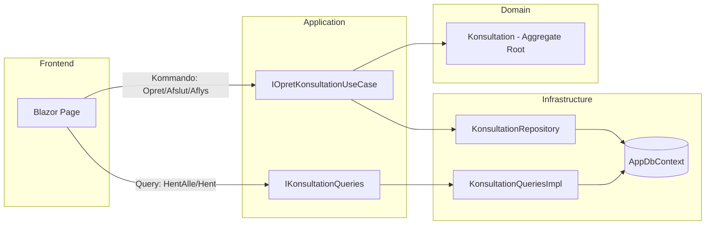
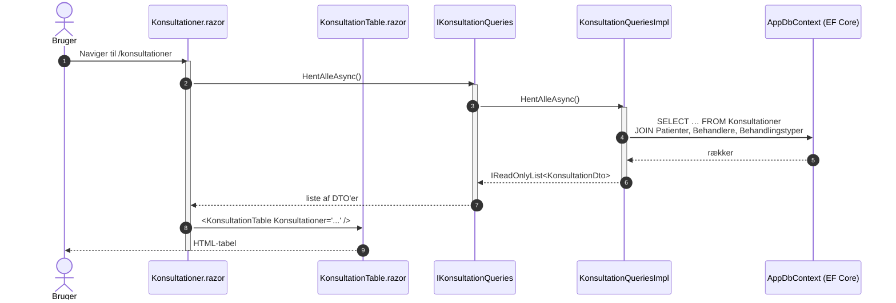
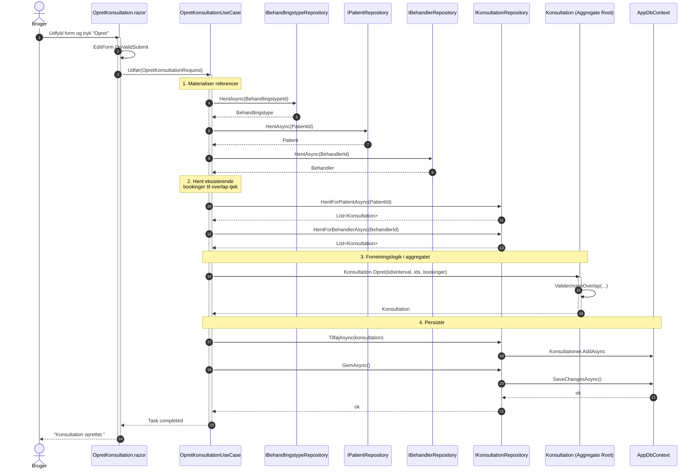
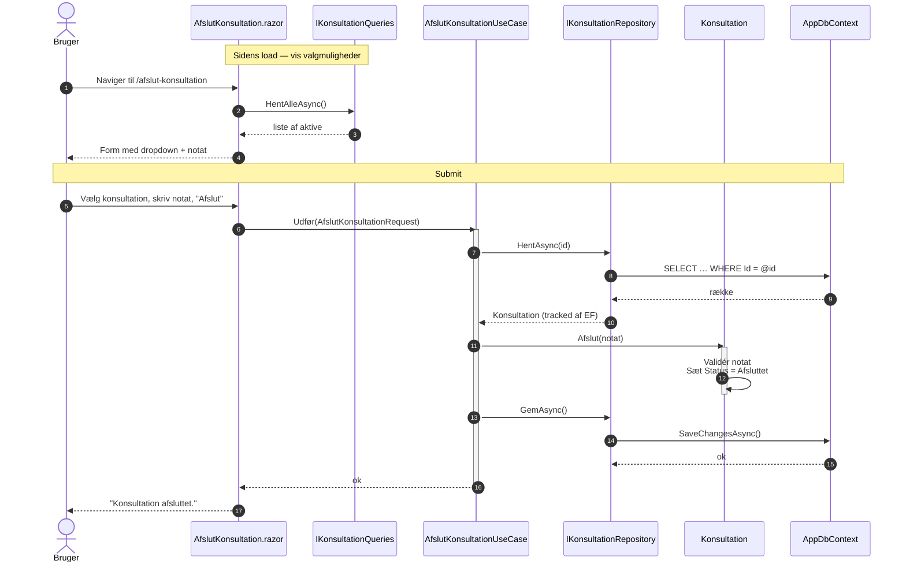
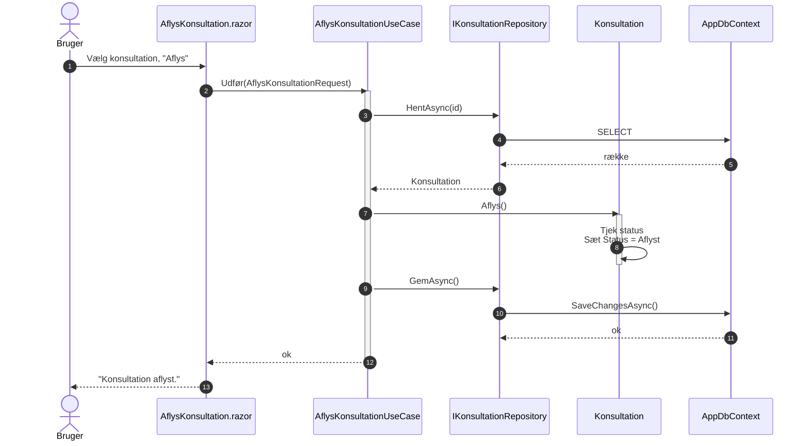

# MinKlinik — Arkitektur og Flow

> Pædagogisk gennemgang af eksempelprojektet. Formålet er at give de studerende et samlet overblik over hvordan **OOP**, **SOLID**, **Clean Architecture**, **CQS**, **DDD** (med **Aggregate Root**) og **Blazor** spiller sammen for at skabe vedligeholdelsesvenlig kvalitetskode.

Læs gerne dokumentet i den rækkefølge afsnittene præsenteres:

1. Først forklares projektets **struktur** med tekst og **C4-diagrammer** (kontekst → container → komponent).
2. Dernæst følger en **flow-gennemgang** med **sekvensdiagrammer**, der viser præcis hvordan en kommando bevæger sig fra Blazor-frontend ned til databasen — og en query bevæger sig den anden vej op.

---

## 1. Strukturel oversigt

### 1.1 Hvilket problem løser arkitekturen?

Den centrale udfordring i et hvilket som helst forretningssystem er, at **forretningsregler skal kunne ændres uafhængigt af UI og persistens** — og omvendt. I MinKlinik er forretningsreglen for eksempel: *"En patient må ikke have to overlappende konsultationer"*. Den regel skal være sand uanset om vi tilgår systemet via Blazor, et REST-API, en Console-app eller en fremtidig mobil-klient.

Vi løser det med fire kernedisciplinerne fra DDD/Clean Architecture:

- **Lagdeling** — koden er delt op i lag, hvor afhængighederne kun peger indad mod domænet.
- **Aggregate Root** — `Konsultation` ejer sine egne forretningsregler. Reglerne kan ikke omgås.
- **CQS** — kommandoer (skriv) og queries (læs) er adskilt og bruger forskellige porte ind i systemet.
- **Dependency Inversion** — højere lag definerer interfaces, lavere lag implementerer dem.

### 1.2 Projektstruktur (mappe-niveau)

```
src/
├── MinKlinik.Domain          ← Forretningsregler. Ingen afhængigheder.
├── MinKlinik.Facade          ← Porte (interfaces) + DTO'er. Ingen afhængigheder ud over Domain.
├── MinKlinik.UseCases        ← Application services (kommando-side). Afhænger af Domain + Facade.
├── MinKlinik.Infrastructure  ← EF Core, repositories, query handlers. Afhænger af alt ovenstående.
├── MinKlinik.Blazor          ← Server-side Blazor UI (frontend).
├── MinKlinik.Api             ← REST-API (alternativ frontend).
└── MinKlinik.Console         ← Konsol-applikation (alternativ frontend).

tests/
├── MinKlinik.Domain.Tests
└── MinKlinik.UseCases.Tests
```

Bemærk at der er **tre frontends** (Blazor, Api, Console). De deler præcis det samme domæne og de samme use cases. Det er hele pointen med Clean Architecture: forretningskoden er genbrugelig på tværs af leveringsmekanismer.

> **Læsevejledning til C4-diagrammerne nedenfor.** Mørkeblå kasser er **personer/aktører**. Mellemblå kasser er **systemer eller containere**. Lyseblå kasser er **komponenter** (assemblies/projekter). Den grå cylinder er **eksterne afhængigheder** — typisk databasen. Fuldt optrukne pile er afhængigheder, der peger samme vej som kaldet (klient kalder server). Stiplede pile betyder "implementerer" — de viser **dependency inversion**, hvor den indre kontrakt ejes af det lag pilen peger på, og det ydre lag tilpasser sig.

### 1.3 C4 — Niveau 1: System Context

C4 niveau 1 viser systemet som en **black box** og hvem og hvad det taler med. Bemærk at databasen ligger **uden for** systemets afgrænsning — det er en ekstern afhængighed, som vi blot integrerer med via EF Core. Det illustrerer en vigtig pointe i Clean Architecture: databasen er en **detalje**, ikke en del af forretningssystemet.



På dette niveau er kun ét spørgsmål interessant: *Hvad er systemets ansvar, hvem taler med det, og hvilke eksterne systemer afhænger det af?* Implementationen er ligegyldig her.

### 1.4 C4 — Niveau 2: Container

C4 niveau 2 zoomer ind i systemet og viser hvilke **deployerbare enheder** det består af. Hver "container" er typisk én proces — eller en kodemæssig kerne der pakkes ind i en proces.

I MinKlinik er der tre frontends (Blazor, REST API, Console), og de deler alle **MinKlinik Core** — den fælles kerne der består af `Facade`, `UseCases`, `Domain` og `Infrastructure`. Kernen er **ikke** en selvstændig proces; den deployes ind i hver enkelt frontend som biblioteker (assemblies). Men logisk set er det den samme kerne der løser forretningsopgaverne, uanset hvilken frontend brugeren ankommer fra.



Pointen: alle tre frontends genbruger **MinKlinik Core**. Frontenden er reduceret til at oversætte input (HTTP-request, formular, kommandolinje) til et kald ned i kernen — og oversætte resultatet tilbage. Skifter vi database, ændres kun Infrastructure-laget *inde i* Core. Tilføjer vi en ny frontend, rører vi slet ikke ved Core.

### 1.5 C4 — Niveau 3: Component (Clean Architecture-lagene)

C4 niveau 3 zoomer ind i **MinKlinik Core**-containeren og viser de logiske komponenter (assemblies/projekter) den består af. Frontenden — her vist som Blazor — er taget med på diagrammet for at illustrere indgangspunktet, men selve kernen er de fire lag i midten. Pilenes retning afspejler **Dependency Rule**: afhængigheder peger altid indad mod domænet, og databasen ligger uden for kernen.



#### Lagenes ansvar — kort opsummering

| Lag | Ansvar | Må afhænge af |
|---|---|---|
| **Domain** | Forretningsregler. Aggregates, Value Objects, domæne-exceptions. | Ingenting. |
| **Facade** | Porte (interfaces) + DTO'er som ydre verden bruger. | Domain. |
| **UseCases** | Orkestrering af et forretningsflow. Henter aggregat, kalder en metode på det, gemmer. | Domain, Facade. |
| **Infrastructure** | EF Core, repositories, query handlers, DI-registrering. | Domain, Facade, UseCases. |
| **Blazor / Api / Console** | Levering: UI eller HTTP. Tager input, kalder en use case eller query, viser resultatet. | Facade. (Composition root må også kende Infrastructure for DI.) |

> **Bemærk SOLID** — denne lagdeling er ren *Dependency Inversion*. Use case-laget ejer `IKonsultationRepository`, og Infrastructure implementerer det. Domænet bestemmer kontrakten, og databasen retter sig efter domænet — ikke omvendt.

### 1.6 CQS — kommando vs. query

I MinKlinik er læs- og skriv-siderne adskilt **både i kontrakt og implementation**:

- **Skriv-siden (Commands)** går igennem `IXxxUseCase` → henter et aggregat via `IXxxRepository` → kalder en metode på aggregatet → gemmer.
- **Læs-siden (Queries)** går igennem `IXxxQueries` → projekterer direkte fra `AppDbContext` til DTO'er.

Læs-siden går altså **uden om aggregaterne**. Det er bevidst: queries skal være billige, kunne joine på tværs og returnere præcis de felter UI'et har brug for. At tvinge en query til at gå gennem et aggregat ville være pseudo-renlighed.



### 1.7 DDD — Aggregate Root i praksis

`Konsultation` er en **Aggregate Root**. Det betyder ifølge `AggregateRoot.cs` fire ting:

1. **Egen livscyklus** — oprettes og afsluttes uafhængigt.
2. **Transaktionsgrænse** — status, notat og tidspunkt ændres som én enhed (`SaveChanges()`).
3. **Eget repository** — `IKonsultationRepository`.
4. **Refereres via ID** — andre aggregater holder kun en `Guid`, ikke en objektreference.

Konkret betyder regel #4 at `Konsultation` har `PatientId`, `BehandlerId`, `BehandlingstypeId` — **ikke** `Patient Patient { get; }`. Det forhindrer programmøren i at navigere på tværs af aggregat-grænser og dermed lække invarianter.

Aggregate Root'ens vigtigste vagthund er **factory-metoden + privat constructor**:

```csharp
private Konsultation(...)         // ingen kan kalde new Konsultation(...)
public static Konsultation Opret(...)  // alle skal igennem her
{
    var k = new Konsultation(...);
    k.ValiderIngenOverlap(...);   // overlap-reglen kan ikke omgås
    return k;
}
```

Uanset hvilken use case, frontend, eller test der opretter en konsultation, kommer overlap-tjekket altid med — fordi det er det eneste sted koden kan oprettes.

`Tidsinterval` er til sammenligning et **Value Object**: ingen identitet, immutable (`record`), sammenlignes på værdi.

---

## 2. Flow gennem systemet

I dette afsnit følger vi datastrømmen fra Blazor-siden ned gennem lagene. Vi gennemgår fire flows:

1. **Læs-flow** — vis listen af konsultationer (query).
2. **Skriv-flow** — opret en ny konsultation (kommando med aggregat-validering).
3. **Skriv-flow** — afslut en konsultation (kommando der muterer eksisterende aggregat).
4. **Skriv-flow** — aflys en konsultation.

### 2.1 Læs-flow: Vis alle konsultationer

Brugeren navigerer til `/konsultationer`. Pagen `Konsultationer.razor` injicerer `IKonsultationQueries` og kalder `HentAlleAsync()` i `OnInitializedAsync`. Resultatet er en `IReadOnlyList<KonsultationDto>` der bindes direkte ind i `KonsultationTable`-komponenten.

Bemærk at vi **ikke** rammer hverken use case-laget eller domænet på læs-siden — det er CQS i praksis.



Pointer at hæfte sig ved:

- `AsNoTracking()` bruges i query handler — vi læser kun, EF skal ikke bygge change-tracker.
- DTO'en `KonsultationDto` indeholder `PatientNavn`, `BehandlerNavn`, `BehandlingstypeNavn` som flade strings. Det er **ikke** domænemodellen — det er et **read-model** skræddersyet til UI'et.

### 2.2 Skriv-flow: Opret konsultation

Brugeren udfylder formularen på `/opret-konsultation`. Når `EditForm` validerer OK, kaldes `OpretKonsultationUseCase.Udfør(...)` med en `OpretKonsultationRequest`. Use case'et **henter referencerede aggregater** for at validere at de eksisterer, henter eksisterende bookinger for både patient og behandler, og kalder `Konsultation.Opret(...)` — det er her overlap-tjekket sker. Først derefter persisteres det nye aggregat.



#### Hvor sker hvad?

| Trin | Lag | Hvorfor netop her? |
|---|---|---|
| Materialiser referencer (1) | UseCase | Eksistens-tjek på fremmede aggregater hører ikke hjemme i `Konsultation` — den ved kun om `Guid`'er. |
| Overlap-tjek (3) | Domain | Det er en *forretningsregel*. Den hører hjemme tæt på dataen den beskytter, så ingen kan omgå den. |
| Persistens (4) | Infrastructure (via repository-interface) | Use case'et kender ikke EF Core — det kender `IKonsultationRepository`. |

#### Fejlbehandling

- `NotFoundException` kastes hvis et refereret aggregat ikke findes (use case-laget).
- `DomainException` kastes ved overlap eller ugyldigt tidsinterval (domænelaget).
- Begge fanges i Razor-pagens `try/catch` og vises som `_fejl`-tekst i UI'et.

### 2.3 Skriv-flow: Afslut konsultation

Et væsentligt mere kortfattet flow, fordi forretningsreglen ("kan ikke afslutte en allerede afsluttet konsultation, notat skal udfyldes") ligger inde i selve aggregatet på metoden `Afslut(notat)`.



> **Bemærk:** Repository'et har **ingen** `Update`-metode. Den er ikke nødvendig — EF Core's change tracker registrerer automatisk at `Status` og `Notat` er ændret på en entity der blev hentet via `HentAsync`. `SaveChangesAsync` sender det rette `UPDATE` afsted. Denne detalje er værd at fremhæve for de studerende, fordi det illustrerer at "Unit of Work"-mønsteret er bagt ind i EF — vi skal ikke selv implementere det.

### 2.4 Skriv-flow: Aflys konsultation

Næsten identisk med afslut-flowet, blot med færre data:



Forskellen til afslut-flowet er at `Aflys()` ikke tager input — den bruger kun aggregatets egen tilstand for at validere at status-overgangen er lovlig (`if (Status == Afsluttet) throw …`).

---

## 3. Sammenhængen til SOLID

Til sidst en kort kortlægning af hvordan koden konkret afspejler SOLID-principperne — så de studerende kan genkende dem i kildekoden:

- **S — Single Responsibility:** Hver use case-klasse gør én ting (`OpretKonsultationUseCase` opretter; `AfslutKonsultationUseCase` afslutter). Repositories laver kun datadgang. Aggregatet beskytter kun sine invarianter.
- **O — Open/Closed:** Vi kan tilføje en ny use case (fx `OmbookKonsultationUseCase`) uden at ændre eksisterende kode. Vi kan tilføje en ny frontend uden at røre Domain eller UseCases.
- **L — Liskov Substitution:** Alle implementationer af `IKonsultationRepository` skal opføre sig identisk fra use case'ets synspunkt. EF-versionen og en evt. fremtidig in-memory test-double er ombyttelige.
- **I — Interface Segregation:** Læs- og skrive-porte er adskilt (`IKonsultationQueries` vs. `IKonsultationRepository`). Hver use case har sit eget smalle interface (`IOpretKonsultationUseCase`).
- **D — Dependency Inversion:** UseCases-laget definerer `IKonsultationRepository`; Infrastructure implementerer det. Det er **omvendt** af hvad man instinktivt vil gøre, og det er præcis hvad der gør domænet uafhængigt af databasen.

---

## 4. Forslag til øvelser

For at teste de studerendes forståelse — opgaver i stigende sværhedsgrad:

1. **Forklar pilen** — peg på pilen i C4-komponentdiagrammet fra `MinKlinik.Infrastructure` til `MinKlinik.UseCases`. Hvorfor peger den i denne retning, og ikke modsat?
2. **Tilføj en ny invariant** — implementér reglen "*en konsultation må højst vare 2 timer*". Hvor i koden placerer du reglen, og hvorfor?
3. **Spor fejlen** — kald `Konsultation.Opret` med `Til = Fra`. Hvor i kaldekæden kastes exception'en? Hvorfor er det netop dér?
4. **Tilføj en ny use case** — `OmbookKonsultationUseCase` der ændrer tidspunkt på en eksisterende konsultation. Hvilke filer skal ændres? Skitsér flowet som sekvensdiagram.
5. **Diskutér CQS-grænsen** — hvorfor må en query lave joins direkte mod `Patient`-tabellen, mens et use case ikke må navigere fra `Konsultation` til `Patient`?
